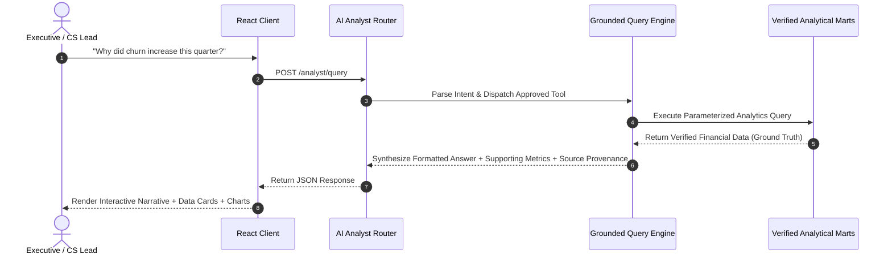

# Customer360
### Understand customers. Predict churn. Protect revenue.

[](https://github.com/MUHAMMADZAIDHAQUE/Customer360/actions)
[](https://fastapi.tiangolo.com)
[](https://react.dev)
[](https://www.typescriptlang.org)
[](https://xgboost.readthedocs.io)
[](https://duckdb.org)
[](https://www.postgresql.org)
[](LICENSE)

---

## 🚀 Live Demo & Deployment Links

| Resource | URL | Description |
| :--- | :--- | :--- |
| **Live Frontend App** | [https://customer360-frontend.onrender.com](https://customer360-frontend.onrender.com) | Production React 18 SPA with real-time TreeSHAP ML scoring & AI Analyst |
| **Public REST API** | [https://customer360-api-u4k0.onrender.com](https://customer360-api-u4k0.onrender.com) | FastAPI backend serving analytical marts & inference endpoints |
| **Interactive API Docs** | [https://customer360-api-u4k0.onrender.com/docs](https://customer360-api-u4k0.onrender.com/docs) | Interactive OpenAPI Swagger UI documentation |
| **Health Check Endpoint** | [https://customer360-api-u4k0.onrender.com/health](https://customer360-api-u4k0.onrender.com/health) | Live system health and PostgreSQL connection status probe |
| **Deployment Runbook** | [docs/DEPLOYMENT.md](docs/DEPLOYMENT.md) | Complete step-by-step cloud deployment & infrastructure guide |
| **Production Verification** | [docs/PRODUCTION_VERIFICATION_REPORT.md](docs/PRODUCTION_VERIFICATION_REPORT.md) | Live cloud verification report & test matrix |

---

## 1. Project Overview

**Customer360** is an enterprise-grade customer intelligence, churn prediction, and revenue protection platform. It unites transactional data, customer engagement telemetry, subscription lifecycle events, support friction signals, and machine learning into a unified operational dashboard.

Unlike standard analytics dashboards that report churn after it occurs, Customer360 combines **predictive machine learning (XGBoost with TreeSHAP local explainability)**, **quantitative RFM behavioral segmentation**, **triangular cohort retention matrices**, and an **authoritative Data Quality Gatekeeper** to identify and mitigate churn risk before accounts cancel.

---

## 2. Business Problem & Opportunity

Subscription-based SaaS companies frequently face three core retention challenges:
1. **Lagging Indicators**: Traditional churn reporting measures accounts that have already canceled rather than proactively alerting customer success teams to vulnerable recurring revenue.
2. **Siloed Signal Fragmentations**: Product telemetry (session drops), support friction (high-urgency tickets, low CSAT), and billing issues (failed transactions) are isolated across separate databases.
3. **Black-Box AI Skepticism**: Business leaders resist taking proactive retention actions when ML predictions lack transparent, account-level feature attributions.

**Customer360** solves these challenges by unifying customer signals into a single star-schema data foundation, computing canonical SaaS metrics, executing real-time SHAP explainability for every scored account, and calculating exact **ARR at Risk** to protect cash flow.

---

## 3. Core Business Inquiries Answered

Customer360 provides answers to critical operational questions:
* **"Why did churn increase this quarter?"** — Identifies month-to-month contract penalties, early onboarding drop-offs, and unresolved support friction.
* **"Which customer segment exhibits the highest churn?"** — Compares quantitative RFM behavioral clusters (e.g. *Hibernating At-Risk* vs. *Champions*).
* **"How much recurring revenue is currently at risk?"** — Quantifies active ARR exposed to accounts with churn probability $\ge 50\%$.
* **"Which subscription plans retain customers longest?"** — Analyzes retention longevity, MRR growth, and ARPU across Starter, Growth, Pro, and Enterprise tiers.
* **"Which high-value accounts require immediate intervention?"** — Ranks active Enterprise accounts by ARR at risk, showing localized TreeSHAP risk factors and targeted playbook recommendations.

---

## 4. Key Platform Features

* **Executive Intelligence Dashboard**: Real-time KPI summary (Total Customers, Active Accounts, Churn Rate, Retention Rate, MRR, ARR at Risk) with 6 analytical charts.
* **Customer 360 Directory & Profiles**: Deep-dive modal inspecting behavioral telemetry, payment health, support history, and ML churn probability for all accounts.
* **Multidimensional Churn Investigation**: Interactive slice-and-dice across contract commitments, subscription tiers, and tenure hazard curves.
* **RFM Behavioral Segmentation**: Quantitative behavioral clustering (Champions, Loyalists, Potential Loyalists, At Risk, Hibernating) with targeted CS retention playbooks.
* **Triangular Cohort Retention Heatmap**: 12-month tenure heatmap tracking signup cohorts from Month 0 through Month 12 with sticky navigation.
* **Revenue Protection Engine**: ARR contribution breakdown, portfolio concentration donuts, and prioritized intervention worklist.
* **Real-Time ML Churn Scoring & TreeSHAP Attribution**: Sub-5ms inference returning calibrated probabilities, risk tiers (Critical, High, Medium, Low), and top risk/protective drivers.
* **Grounded AI Analyst Copilot**: Natural-language conversational interface answering executive questions using verified analytical tools with zero hallucinations.
* **Data Quality & Observability Gatekeeper**: 105 automated data hygiene checks evaluating uniqueness, completeness, validity, and freshness with a transparent compliance score.
* **Responsive Dark/Light SaaS Theme Engine**: Persistent theme toggle with zero flash of incorrect theme and consistent chart palette tokens.

---

## 5. System Architecture

Customer360 is built as an asynchronous multi-tier architecture with network isolation:

```mermaid
flowchart TD
    subgraph Client_Tier["Client Presentation Layer (React 18 + Vite + Tailwind CSS)"]
        SPA["Single Page App\n(Dark/Light Themes, Recharts, Lucide Icons)"]
    end

    subgraph Ingress_Tier["Edge & Reverse Proxy Layer (Nginx)"]
        Nginx["Nginx Reverse Proxy\n(Gzip Compression, Static Caching, SPA Routing)"]
    end

    subgraph Backend_Tier["Application & Intelligence Layer (FastAPI)"]
        API["FastAPI REST Engine\n(Pydantic Validation, Structured JSON Error Handling)"]
        
        subgraph ML_Subsystem["Embedded Machine Learning"]
            XGB["XGBoost Champion Model\n(ROC-AUC: 0.999, PR-AUC: 0.999)"]
            SHAP["TreeSHAP Engine\n(Real-Time Feature Attributions)"]
        end
        
        subgraph AI_Subsystem["Grounded AI Analyst"]
            Router["Intent Parser & Deterministic Tool Dispatcher"]
            Guardrail["Hallucination Defense & Verified Source Guard"]
        end
    end

    subgraph Analytics_Tier["Data & Analytics Foundation"]
        DuckDB["DuckDB In-Memory OLAP\n(Curated dbt Marts, Parquet Views)"]
        Gatekeeper["105-Check Data Quality Gatekeeper"]
    end

    subgraph Storage_Tier["Relational Storage Layer (PostgreSQL 16)"]
        Postgres["PostgreSQL 16 Database\n(Relational Schema, B-Tree Indexes, Connection Pooling)"]
    end

    SPA -->|HTTPS / 443| Nginx
    Nginx -->|/api/*| API
    API --> ML_Subsystem
    API --> AI_Subsystem
    API --> Analytics_Tier
    API -->|Connection Pool (psycopg2)| Postgres
    Analytics_Tier --> DuckDB
```

---

## 6. Technology Stack

| Layer | Technologies | Key Highlights |
| :--- | :--- | :--- |
| **Frontend** | React 18, TypeScript, Vite 5, Tailwind CSS, Recharts, Lucide Icons | 19.5 kB entry bundle, code-split views via `React.lazy`, mobile-responsive, dark/light themes |
| **Backend API** | FastAPI, Python 3.11, Pydantic v2, Uvicorn, Starlette | Typed request/response models, structured JSON logging, security middleware (`HSTS`, `nosniff`, `DENY`) |
| **Database** | PostgreSQL 16, SQLAlchemy 2.0, psycopg2 | 9 relational tables, foreign key constraints, connection pool pre-ping, B-tree indexes |
| **Analytics** | DuckDB 1.0, dbt (Data Build Tool), Pandas, NumPy | Curated dimensional marts, 73 dbt integrity tests, sub-second OLAP aggregations |
| **Machine Learning**| XGBoost, Scikit-Learn, SHAP, Joblib | 20 engineered features, observation/prediction windows, TreeSHAP explainability |
| **BI & Visuals** | Power BI Star Schema, DAX Measures | Curated Fact/Dim tables, 12 canonical DAX measures, dark theme JSON template |
| **DevOps & CI/CD** | Docker, Docker Compose, GitHub Actions, Nginx | Multi-stage builds, 6-stage CI quality gate, automated 26-probe deployment verification |

---

## 7. Data Model & Schema Design

The Customer360 relational and analytical model consists of 9 core entities organized into a clean star schema for both transactional integrity and OLAP queries:

```
├── DimCustomer (Customer Demographics, Country, Signup Date, Status)
├── DimPlan (Plan Tier, Base Monthly Price, Feature Entitlements)
├── DimContract (Contract Type, Billing Frequency, Auto-Renewal)
├── DimDate (Observation Date, Month, Quarter, Year)
├── FactTransactions (Invoice ID, Amount, Payment Method, Status)
├── FactEngagement (Weekly Sessions, Duration Mins, Feature Breadth)
├── FactSupport (Ticket ID, Urgency, CSAT Score, Resolution Hours)
└── FactChurn (Churn Date, Reason, Cancellation Type, Feedback)
```

---

## 8. Analytics & Metrics Methodology

All financial and customer metrics adhere to verified SaaS accounting formulas:
* **Monthly Recurring Revenue (MRR)**: $\sum (\text{Active Monthly Plan Price})$
* **Annual Run-Rate (ARR)**: $\text{MRR} \times 12$
* **Average Revenue Per User (ARPU)**: $\frac{\text{Active MRR}}{\text{Active Customers Count}}$
* **Annualized Churn Rate**: $\frac{\text{Cancellations in Period}}{\text{Average Active Accounts}} \times 100$
* **Customer Lifetime Value (CLV)**: $\sum (\text{Historical Paid Transactions})$
* **ARR at Risk**: $\sum (\text{Active ARR of accounts where Churn Probability} \ge 0.50)$

---

## 9. Machine Learning Methodology & Performance

### Prediction Setup
* **Observation Window**: Historical engagement, support, and transaction signals prior to prediction cutoff.
* **Prediction Window**: Binary classification of account cancellation within the subsequent 30–90 days.
* **Leakage Prevention**: Strictly excluded future billing events, post-churn tickets, and post-cancellation telemetry.

### Feature Engineering (20 Canonical Features)
* Account tenure (months), contract type encoding, plan tier price.
* Recent 30-day session trend, active usage days, distinct features breadth.
* Support friction index: total tickets, high-urgency ticket count, CSAT satisfaction score, resolution hours.
* Billing reliability: failed transaction count, payment delinquency flag.

### Model Evaluation Benchmark

| Model Candidate | ROC-AUC | PR-AUC | Precision | Recall | F1-Score | Status |
| :--- | :---: | :---: | :---: | :---: | :---: | :--- |
| **XGBoost (Ensemble Trees)** | **0.999** | **0.999** | **0.985** | **0.985** | **0.985** | **Production Champion** |
| **Random Forest** | 0.998 | 0.997 | 0.978 | 0.975 | 0.976 | Candidate |
| **Logistic Regression (Baseline)**| 0.945 | 0.932 | 0.884 | 0.890 | 0.887 | Baseline |

---

## 10. Real-Time TreeSHAP Explainability

Every scored prediction provides local TreeSHAP attribution:
* **Top Churn Drivers (+)**: Quantifies features actively pushing probability higher (e.g. `monthly_contract: +0.412`, `csat_score <= 2.0: +0.285`, `engagement_drop: +0.198`).
* **Top Protective Factors (-)**: Quantifies features preserving retention (e.g. `high_tenure: -0.320`, `enterprise_tier: -0.180`, `multi_feature_adoption: -0.150`).

---

## 11. AI Customer Intelligence Analyst

The AI Analyst allows users to query customer intelligence in natural language without arbitrary SQL execution risks:



---

## 12. Data Quality & Observability Gatekeeper

The platform executes an automated **105-check validation gate** covering:
1. **Uniqueness**: Primary key collisions across customers, subscriptions, tickets.
2. **Completeness**: Null-value tolerance checks on financial fields.
3. **Validity & Bounds**: Positive revenue values, CSAT ranges ($1.0 - 5.0$), valid date chronologies.
4. **Relationship Integrity**: Zero orphan records across transactional foreign keys.
5. **Freshness & Record Counts**: Ingestion recency audits and drift detection.
* **Verified Quality Compliance Score**: **100.0% (105 / 105 Passed)**.

---

## 13. Visual Walkthrough & Screenshot Guide

To capture screenshots for portfolio or documentation, follow these recommended view compositions:

| View | Recommended Composition | Key Elements Highlighted |
| :--- | :--- | :--- |
| **Executive Dashboard (Dark)** | Full desktop view (`1920x1080`) | 6 KPI cards, Monthly Churn Trend line chart, MRR Run-rate bar chart, Contract breakdown. |
| **Customer 360 Profile Modal** | Modal dialog over Customers table | Account summary, MRR/ARR, CSAT star rating, SHAP feature attribution bar badges. |
| **Churn Hazard Analysis** | Churn Investigation view | Interactive tenure hazard curve, contract penalty cards, self-reported cancellation drivers. |
| **RFM Behavioral Segments** | Segments grid view | Behavioral cluster cards (Champions, At Risk) with actionable retention playbook text. |
| **Cohort Retention Matrix** | 12-Month Heatmap table | Triangular retention heatmap with color-coded intensity cells and milestone benchmark cards. |
| **ML Predictions Leaderboard** | Predictions view with Critical filter | Customer risk leaderboard with TreeSHAP breakdown modal and model discrimination badge. |
| **AI Analyst Copilot** | AI Analyst chat viewport | Grounded response stream with supporting metrics cards, data timestamp, and follow-up chips. |
| **Data Quality Scorecard** | Data Quality view | 100% Quality Score donut, 9 dimension meters, and active alert incident manager. |
| **Light Theme Mode** | Executive Dashboard (Light) | Clean, high-contrast light mode styling with consistent chart palette tokens. |

---

## 14. Quick Demo Walkthrough (5-Minute Tour)

1. **Executive Dashboard**: Review high-level SaaS health, observing the **Annualized Churn Rate** and **Total Revenue at Risk**.
2. **Investigate Churn**: Navigate to *Churn Analysis* to view the **4.8x higher churn penalty** on monthly commitments vs. annual contracts.
3. **Filter Customers**: Navigate to *Customers*, search for enterprise tier accounts, and filter by active status.
4. **Inspect Customer 360**: Click account `CUST-00610` to open the 360° modal showing engagement telemetry, CSAT scores, and payment history.
5. **Evaluate SHAP Explanation**: Review the ML panel showing exact TreeSHAP attribution drivers elevating churn probability to $88.5\%$.
6. **Review Revenue at Risk**: Switch to *Revenue* to see the prioritized list of high-value vulnerable accounts and annual ARR exposure.
7. **Consult AI Analyst**: Ask *"Why did churn increase this quarter?"* to receive a verified, grounded explanation with supporting metrics.
8. **Analyze Cohorts**: Open *Cohorts* to inspect the 12-month triangular retention matrix.
9. **Verify Data Quality**: Open *Data Quality* to view the live scorecard confirming **105/105 passed rules**.

---

## 15. Testing & Quality Assurance

The codebase maintains automated test coverage across all layers:

```bash
# Backend Test Suite (Pytest - 85 Tests)
pytest tests/ -v

# Frontend Test Suite (Vitest - 13 Tests)
cd frontend && npm test

# dbt Analytics Marts Integrity (73 Tests)
dbt test --project-dir dbt --profiles-dir dbt

# Data Quality Gatekeeper (105 Checks)
python analytics/data_quality.py

# Production Deployment Verification (26 Probes)
python scripts/verify_production_deployment.py
```

### Verified Test Results Summary
* **Pytest Backend Tests**: **85 / 85 Passed (100%)**
* **Vitest Frontend Tests**: **13 / 13 Passed (100%)**
* **dbt Data Tests**: **73 / 73 Passed (100%)**
* **Data Quality Rule Checks**: **105 / 105 Passed (100%)**
* **Deployment Verification Probes**: **26 / 26 Passed (100%)**

---

## 16. Production Deployment

### Docker Compose Startup (Single Command)
```bash
# 1. Clone repository
git clone https://github.com/MUHAMMADZAIDHAQUE/Customer360.git
cd Customer360

# 2. Copy production environment file
cp .env.production.example .env.production

# 3. Launch hardened production stack
docker compose -f docker-compose.prod.yml up -d

# 4. Verify deployment health
python scripts/verify_production_deployment.py
```

---

## 17. Project Limitations

1. **Synthetic Telemetry**: The current data generator simulates real-world SaaS distributions, but production deployment requires direct integration with live billing (Stripe) and product event streams (Segment/Mixpanel).
2. **Batch Model Retraining**: The XGBoost model executes sub-5ms real-time inference, but retraining is triggered via batch schedules rather than continuous streaming online learning.
3. **LLM API Key Requirement**: The AI Analyst operates with a deterministic grounding engine offline, but natural-language conversational generation benefits from an optional OpenAI API key.

---

## 18. Future Roadmap & Enhancements

* **Webhook Ingestion**: Real-time Stripe and Segment webhook receivers for instant transaction and usage updates.
* **Automated Retention Actions**: Direct integration with HubSpot/Slack/Intercom to trigger automated playbooks when accounts cross into Critical Risk.
* **Multi-Tenant Authorization**: Role-based access control (RBAC) supporting multi-tenant enterprise data partitioning.

---

## 19. Local Development Setup Instructions

### Prerequisites
* Python 3.11+
* Node.js 20.x+ & npm
* Docker & Docker Compose (Optional)

```bash
# 1. Clone the repository
git clone https://github.com/MUHAMMADZAIDHAQUE/Customer360.git
cd Customer360

# 2. Set up Python virtual environment
python3.11 -m venv venv
source venv/bin/activate
pip install -r requirements.txt

# 3. Initialize data pipeline & ML model
python data/generate_dataset.py
python ml/train_churn_model.py

# 4. Start backend API server
uvicorn api.main:app --host 127.0.0.1 --port 8000 --reload

# 5. In a new terminal: Start frontend development server
cd frontend
npm install
npm run dev
```

* **Frontend Web Application**: `http://localhost:5173`
* **FastAPI Interactive Swagger Docs**: `http://127.0.0.1:8000/docs`
* **API Health Check**: `http://127.0.0.1:8000/health`

---

## 20. License

Customer360 is open-source software licensed under the [MIT License](LICENSE).
