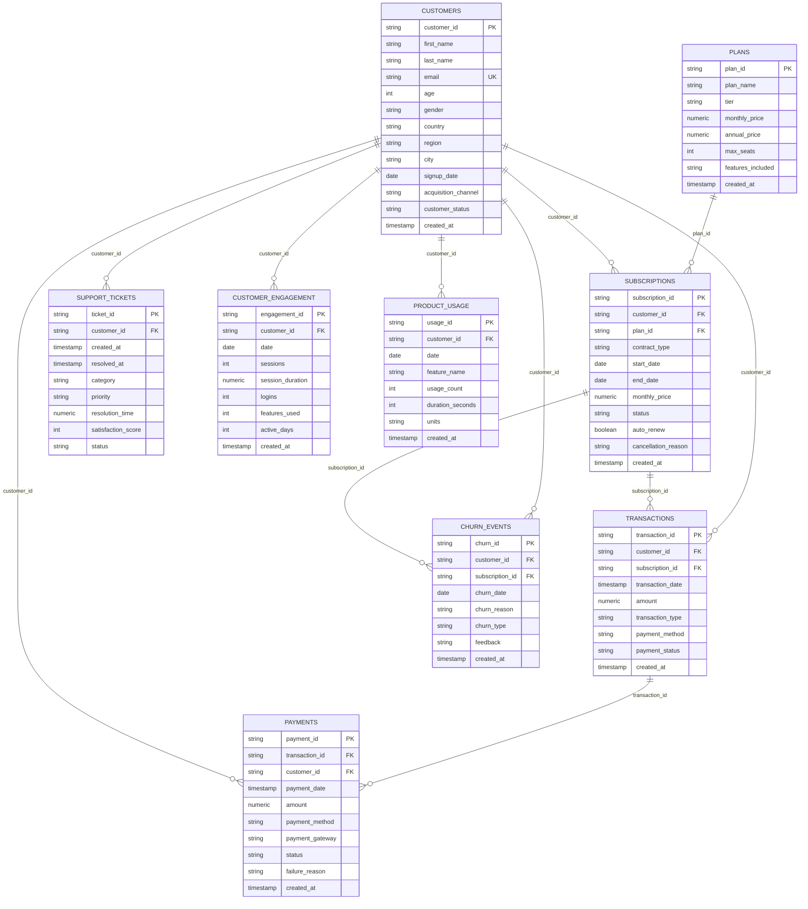

# Customer360 - Data Dictionary & Architecture Specifications

## 1. Entity-Relationship Model (ERD)

---

## 2. Table & Column Definitions

### 2.1 `plans`
Catalog of subscription tiers available for purchase.

| Column | Data Type | Nullable | Constraints | Description |
| :--- | :--- | :--- | :--- | :--- |
| `plan_id` | VARCHAR(32) | NO | PRIMARY KEY | Unique identifier for plan (e.g., `plan_starter`) |
| `plan_name` | VARCHAR(64) | NO | | Marketing display name (Starter, Growth, Pro, Enterprise) |
| `tier` | VARCHAR(32) | NO | | Plan tier classification |
| `monthly_price` | NUMERIC(10,2) | NO | >= 0 | Standard monthly list price in USD |
| `annual_price` | NUMERIC(10,2) | NO | >= 0 | Discounted upfront annual price in USD |
| `max_seats` | INT | NO | > 0 | Maximum licensed team seats allowed |
| `features_included` | TEXT | YES | | Comma-delimited list of platform entitlements |
| `created_at` | TIMESTAMP | NO | DEFAULT NOW() | System record creation timestamp |

### 2.2 `customers`
The central entity representing individual subscriber accounts.

| Column | Data Type | Nullable | Constraints | Description |
| :--- | :--- | :--- | :--- | :--- |
| `customer_id` | VARCHAR(32) | NO | PRIMARY KEY | Unique customer ID (`CUST-00001`) |
| `first_name` | VARCHAR(64) | NO | | Customer first name |
| `last_name` | VARCHAR(64) | NO | | Customer surname |
| `email` | VARCHAR(128) | NO | UNIQUE | Primary corporate contact email address |
| `age` | INT | YES | 18 <= age <= 100 | Customer age in years |
| `gender` | VARCHAR(16) | YES | | Self-reported gender |
| `country` | VARCHAR(64) | NO | | Primary geographic country |
| `region` | VARCHAR(64) | YES | | State / province / territory |
| `city` | VARCHAR(64) | YES | | City of registration |
| `signup_date` | DATE | NO | | Initial platform registration date |
| `acquisition_channel` | VARCHAR(64) | NO | | Attribution source (Organic, Paid Ads, Referral, Partner, etc.) |
| `customer_status` | VARCHAR(32) | NO | 'active', 'churned', 'paused' | Current operational status of customer |
| `created_at` | TIMESTAMP | NO | DEFAULT NOW() | System record creation timestamp |

### 2.3 `subscriptions`
Billing agreement linking customer to plan over specific contractual duration.

| Column | Data Type | Nullable | Constraints | Description |
| :--- | :--- | :--- | :--- | :--- |
| `subscription_id` | VARCHAR(32) | NO | PRIMARY KEY | Unique subscription ID (`SUB-000001`) |
| `customer_id` | VARCHAR(32) | NO | FK -> customers | Foreign key referencing subscriber |
| `plan_id` | VARCHAR(32) | NO | FK -> plans | Foreign key referencing subscribed tier |
| `contract_type` | VARCHAR(32) | NO | 'monthly', 'annual', 'multi_year' | Contractual duration commitment |
| `start_date` | DATE | NO | | Subscription activation date |
| `end_date` | DATE | YES | end_date >= start_date | Cancellation or expiration date (NULL if active) |
| `monthly_price` | NUMERIC(10,2) | NO | >= 0 | Billed monthly recurring revenue (MRR) equivalent |
| `status` | VARCHAR(32) | NO | 'active', 'cancelled', 'past_due', 'expired' | Current lifecycle status |
| `auto_renew` | BOOLEAN | NO | DEFAULT TRUE | Auto-renewal authorization flag |
| `cancellation_reason` | VARCHAR(255) | YES | | Notes logged at time of cancellation |
| `created_at` | TIMESTAMP | NO | DEFAULT NOW() | Record creation timestamp |

### 2.4 `transactions`
Commercial billing ledger records.

| Column | Data Type | Nullable | Constraints | Description |
| :--- | :--- | :--- | :--- | :--- |
| `transaction_id` | VARCHAR(32) | NO | PRIMARY KEY | Unique transaction ID (`TXN-0000001`) |
| `customer_id` | VARCHAR(32) | NO | FK -> customers | Subscriber charged |
| `subscription_id` | VARCHAR(32) | YES | FK -> subscriptions | Associated subscription billing agreement |
| `transaction_date` | TIMESTAMP | NO | | Timestamp invoice was generated |
| `amount` | NUMERIC(10,2) | NO | >= 0 | Monetary charge value in USD |
| `transaction_type` | VARCHAR(32) | NO | | 'subscription_charge', 'upgrade_charge', 'refund', 'add_on' |
| `payment_method` | VARCHAR(32) | NO | | 'credit_card', 'paypal', 'bank_transfer', 'crypto' |
| `payment_status` | VARCHAR(32) | NO | | 'succeeded', 'failed', 'refunded', 'pending' |
| `created_at` | TIMESTAMP | NO | DEFAULT NOW() | Record creation timestamp |

### 2.5 `payments`
Gateway execution attempts linked to billing transactions.

| Column | Data Type | Nullable | Constraints | Description |
| :--- | :--- | :--- | :--- | :--- |
| `payment_id` | VARCHAR(32) | NO | PRIMARY KEY | Unique payment ID (`PAY-0000001`) |
| `transaction_id` | VARCHAR(32) | NO | FK -> transactions | Associated invoice transaction |
| `customer_id` | VARCHAR(32) | NO | FK -> customers | Associated subscriber |
| `payment_date` | TIMESTAMP | NO | | Gateway execution timestamp |
| `amount` | NUMERIC(10,2) | NO | >= 0 | Amount processed by gateway |
| `payment_method` | VARCHAR(32) | NO | | Payment vehicle |
| `payment_gateway` | VARCHAR(32) | NO | 'stripe', 'adyen', 'braintree' | Processing payment provider |
| `status` | VARCHAR(32) | NO | 'completed', 'failed', 'declined', 'processing' | Settlement result |
| `failure_reason` | VARCHAR(255) | YES | | Gateway error message if declined |
| `created_at` | TIMESTAMP | NO | DEFAULT NOW() | Record creation timestamp |

### 2.6 `support_tickets`
Service desk interactions reflecting customer satisfaction and friction.

| Column | Data Type | Nullable | Constraints | Description |
| :--- | :--- | :--- | :--- | :--- |
| `ticket_id` | VARCHAR(32) | NO | PRIMARY KEY | Unique support ticket ID (`TCK-000001`) |
| `customer_id` | VARCHAR(32) | NO | FK -> customers | Submitting customer |
| `created_at` | TIMESTAMP | NO | | Ticket submission timestamp |
| `resolved_at` | TIMESTAMP | YES | resolved_at >= created_at | Ticket resolution timestamp |
| `category` | VARCHAR(64) | NO | | 'billing', 'technical_issue', 'account_access', 'feature_request', 'cancellation_request' |
| `priority` | VARCHAR(32) | NO | 'low', 'medium', 'high', 'urgent' | Ticket severity level |
| `resolution_time` | NUMERIC(8,2) | YES | | Time taken to resolve in decimal hours |
| `satisfaction_score` | INT | YES | 1 <= score <= 5 | Customer CSAT score (1=Very Dissatisfied, 5=Delighted) |
| `status` | VARCHAR(32) | NO | 'closed', 'resolved', 'open', 'in_progress' | Case lifecycle status |

### 2.7 `customer_engagement`
Weekly rolled-up product telemetry capturing platform habituation.

| Column | Data Type | Nullable | Constraints | Description |
| :--- | :--- | :--- | :--- | :--- |
| `engagement_id` | VARCHAR(32) | NO | PRIMARY KEY | Unique engagement record ID |
| `customer_id` | VARCHAR(32) | NO | FK -> customers | Account tracked |
| `date` | DATE | NO | UNIQUE(customer_id, date) | Observation window start date |
| `sessions` | INT | NO | >= 0 | Total browser / desktop active sessions |
| `session_duration` | NUMERIC(10,2) | NO | >= 0 | Cumulative active platform duration in minutes |
| `logins` | INT | NO | >= 0 | Total login events |
| `features_used` | INT | NO | >= 0 | Number of distinct product features exercised |
| `active_days` | INT | NO | 0 <= active_days <= 31 | Number of active calendar days in period |
| `created_at` | TIMESTAMP | NO | DEFAULT NOW() | Ingestion timestamp |

### 2.8 `product_usage`
Feature-level granularity capturing specific functional adoption.

| Column | Data Type | Nullable | Constraints | Description |
| :--- | :--- | :--- | :--- | :--- |
| `usage_id` | VARCHAR(32) | NO | PRIMARY KEY | Unique feature usage event ID |
| `customer_id` | VARCHAR(32) | NO | FK -> customers | Subscriber account |
| `date` | DATE | NO | | Date of usage |
| `feature_name` | VARCHAR(64) | NO | | 'dashboard_view', 'report_export', 'api_request', 'team_collaboration', 'automated_workflow', 'ai_query' |
| `usage_count` | INT | NO | >= 0 | Volume of operations executed |
| `duration_seconds` | INT | NO | >= 0 | Time spent utilizing feature |
| `units` | VARCHAR(32) | NO | DEFAULT 'events' | Unit of measurement |
| `created_at` | TIMESTAMP | NO | DEFAULT NOW() | Ingestion timestamp |

### 2.9 `churn_events`
Terminal departure records for subscribers who discontinued service.

| Column | Data Type | Nullable | Constraints | Description |
| :--- | :--- | :--- | :--- | :--- |
| `churn_id` | VARCHAR(32) | NO | PRIMARY KEY | Unique churn event ID |
| `customer_id` | VARCHAR(32) | NO | FK -> customers | Churned account |
| `subscription_id` | VARCHAR(32) | NO | FK -> subscriptions | Terminated subscription |
| `churn_date` | DATE | NO | | Official cancellation effective date |
| `churn_reason` | VARCHAR(128) | NO | | 'price_sensitivity', 'competitor_switch', 'lack_of_features', 'poor_support', 'infrequent_use', 'payment_delinquency' |
| `churn_type` | VARCHAR(32) | NO | 'voluntary', 'involuntary' | Voluntary cancellation vs payment delinquency |
| `feedback` | TEXT | YES | | Customer exit survey statement |
| `created_at` | TIMESTAMP | NO | DEFAULT NOW() | Timestamp logged |

---

## 3. Data Generation Logic & Behavioral Dynamics

1. **Tenure & Habituation**: Customers with longer tenure (>6 months) demonstrate stabilized session cadences and higher adoption of automated workflows and API requests.
2. **Engagement Decay Prior to Churn**: Customers scheduled to churn exhibit a statistically sharp decline in sessions and features used 3 to 4 weeks prior to cancellation date.
3. **Support Escalation**: Churning accounts suffer 2.5x higher ticket volume with high urgency and average satisfaction scores below 2.5/5.
4. **Contractual Moats**: Annual contracts experience 55% lower monthly churn velocity compared to month-to-month contracts.
5. **Channel Heterogeneity**: Referral and Direct customers maintain highest lifetime value and lowest churn hazard; Paid Ads and Social channels exhibit higher initial drop-off.
6. **Zero Target Leakage**: All usage, telemetry, tickets, and transactions are strictly timestamped prior to subscription termination.

---

## 4. Assumptions & Limitations

* **Single Currency**: All financial figures are denominated in USD ($).
* **Synthetic Demographics**: Customer names, cities, and corporate domains are synthetically generated for privacy compliance.
* **Deterministic Randomness**: Controlled by fixed seed (`42`), ensuring 100% reproducible data distributions across environments.
