# Customer360 - dbt Model Lineage & Architecture

This document describes the complete transformation directed acyclic graph (DAG) across the 4 analytics engineering layers:
**Raw Sources** $\rightarrow$ **Staging Views** $\rightarrow$ **Intermediate Business Views** $\rightarrow$ **Analytical Marts**.

---

## 1. Lineage Directed Acyclic Graph (DAG)

```mermaid
graph TD
    subgraph Raw Sources [Parquet Data Layer]
        src_cust[raw_parquet.customers]
        src_plans[raw_parquet.plans]
        src_subs[raw_parquet.subscriptions]
        src_tx[raw_parquet.transactions]
        src_pay[raw_parquet.payments]
        src_tck[raw_parquet.support_tickets]
        src_eng[raw_parquet.customer_engagement]
        src_usg[raw_parquet.product_usage]
        src_churn[raw_parquet.churn_events]
    end

    subgraph Staging Layer [Sanitization & Casting]
        stg_cust[stg_customers]
        stg_plans[stg_plans]
        stg_subs[stg_subscriptions]
        stg_tx[stg_transactions]
        stg_pay[stg_payments]
        stg_tck[stg_support]
        stg_eng[stg_engagement]
        stg_usg[stg_product_usage]
        stg_churn[stg_churn_events]
    end

    subgraph Intermediate Layer [Business Logic & Entities]
        int_activity[customer_activity]
        int_rev[customer_revenue]
        int_supp[customer_support]
        int_eng[customer_engagement]
        int_sub_hist[customer_subscription_history]
    end

    subgraph Marts Layer [Star Schema & Analytical Marts]
        mart_360[mart_customer_360]
        mart_revenue[mart_customer_revenue]
        mart_churn[mart_customer_churn]
        mart_segments[mart_customer_segments]
        mart_cohorts[mart_cohort_retention]
        mart_kpis[mart_monthly_kpis]
    end

    %% Raw to Staging
    src_cust --> stg_cust
    src_plans --> stg_plans
    src_subs --> stg_subs
    src_tx --> stg_tx
    src_pay --> stg_pay
    src_tck --> stg_tck
    src_eng --> stg_eng
    src_usg --> stg_usg
    src_churn --> stg_churn

    %% Staging to Intermediate
    stg_eng --> int_activity
    stg_usg --> int_activity
    stg_eng --> int_eng
    stg_tx --> int_rev
    stg_subs --> int_rev
    stg_tck --> int_supp
    stg_subs --> int_sub_hist
    stg_plans --> int_sub_hist
    stg_churn --> int_sub_hist

    %% Intermediate to Marts
    stg_cust --> mart_360
    int_sub_hist --> mart_360
    int_rev --> mart_360
    int_activity --> mart_360
    int_supp --> mart_360

    stg_tx --> mart_revenue
    int_sub_hist --> mart_revenue

    mart_360 --> mart_churn
    mart_360 --> mart_segments

    stg_cust --> mart_cohorts
    int_sub_hist --> mart_cohorts

    stg_cust --> mart_kpis
    mart_360 --> mart_kpis
    stg_tx --> mart_kpis
```

---

## 2. Layer Specifications

### 2.1 Staging Models (`models/staging/`)
* **Materialization**: `view`
* **Purpose**: 1-to-1 extraction from Parquet sources, column normalization, type casting, string trimming, and naming standardization.
* **Models**:
  1. `stg_customers`: Standardizes customer demographic dimensions, emails, and signup dates.
  2. `stg_plans`: Normalizes plan tiers and monthly/annual pricing.
  3. `stg_subscriptions`: Casts contract types, renewal flags, and start/end dates.
  4. `stg_transactions`: Cleans transaction timestamps, payment methods, and invoice statuses.
  5. `stg_payments`: Cleans gateway settlements and failure reasons.
  6. `stg_support`: Cleans ticket categories, resolution hours, and satisfaction ratings.
  7. `stg_engagement`: Normalizes session duration, active days, and logins.
  8. `stg_product_usage`: Casts feature usage counts and duration metrics.
  9. `stg_churn_events`: Cleans churn dates, exit reasons, and customer feedback.

### 2.2 Intermediate Models (`models/intermediate/`)
* **Materialization**: `view`
* **Purpose**: Multi-table joining, customer-level grain rollups, window functions, and business logic preparation.
* **Models**:
  1. `customer_activity`: Computes lifetime sessions, feature breadth, and identifies customers with a >50% trailing session decay.
  2. `customer_revenue`: Aggregates historical invoices, realized lifetime revenue (CLV), active MRR/ARR, and flags payment delinquency.
  3. `customer_support`: Rollup of tickets by category, high urgency ticket volume, average resolution time, and identifies support friction (CSAT $\le 2.5$).
  4. `customer_engagement`: Weekly session cadences, peak activity weeks, and average active days.
  5. `customer_subscription_history`: Traces complete customer subscription progression, contract types, tenure in days/months, and links churn events.

### 2.3 Analytical Marts (`models/marts/`)
* **Materialization**: `table` (High-performance analytical tables in DuckDB)
* **Purpose**: Executive decision-making, reporting dimensions, cohort matrices, and machine learning feature readiness.
* **Models**:
  1. `mart_customer_360`: Unified customer master dimension combining revenue, engagement, support, churn, and revenue-at-risk flags.
  2. `mart_customer_revenue`: Revenue rankings (`DENSE_RANK()`, `PERCENT_RANK()`), ARR, and customer spend tiers (`Top 50`, `Top 200`, `General`).
  3. `mart_customer_churn`: Multidimensional churn analytics across contract types, pricing tiers, tenure cohorts, regions, and CSAT buckets with windowed benchmark rates.
  4. `mart_customer_segments`: Automated Recency-Frequency-Monetary (RFM) scoring via `NTILE(5)` and rule-based customer segment clustering (Champions, Loyal, At Risk, Cant Lose Them, Hibernating).
  5. `mart_cohort_retention`: Triangular cohort retention matrix tracking customer and MRR retention across Months 0 to 12.
  6. `mart_monthly_kpis`: Executive monthly subscription and financial metrics (MRR, ARR, ARPU, Net Growth, Churn Rate %, Retention Rate %, Cash Collected).

---

## 3. Test Coverage Matrix

Every model is covered by automated schema and custom SQL tests:

| Test Type | Applied Count | Coverage Examples |
| :--- | :--- | :--- |
| **Unique Tests** | 16 | Primary keys across all staging and mart entities |
| **Not-Null Tests** | 43 | Mandatory IDs, status columns, dates, and amounts |
| **Accepted Values** | 8 | Statuses (`active`, `churned`), tiers, contract types |
| **Relationship Tests** | 6 | Foreign keys between subscriptions, transactions, customers, and plans |
| **Custom Singular Tests**| 3 | `assert_positive_revenue`, `assert_valid_churn_rates`, `assert_customer_360_integrity` |
| **Total Automated Tests**| **73** | **100% Passed (PASS=73, WARN=0, ERROR=0)** |
