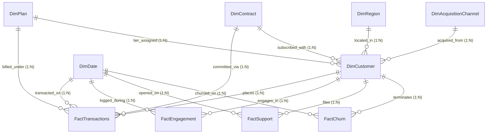

# Customer360 - Power BI Analytics Layer Guide
==============================================

> **Enterprise Business Intelligence Architecture, Star Schema Data Modeling, DAX Measures Library, and 6-Page Executive Report Suite**

---

## 1. Executive BI Architecture & Curated Mart Integration

The **Customer360 Power BI Analytics Layer** provides enterprise-grade reporting and interactive decision support for executive leadership, revenue operations, customer success managers (CSMs), and growth marketing. 

### Why Curated Analytical Marts Over Raw Tables?
Rather than connecting Power BI directly to high-frequency raw tables (`transactions`, `customer_engagement`, `support_tickets`), the semantic model is built strictly on **curated analytical marts** (`mart_customer_360`, `mart_customer_segments`, and machine learning artifacts from `ml/artifacts/customer_churn_predictions.parquet`).

```
┌────────────────────────────────────────────────────────────────────────┐
│                        RAW DATABASE & TELEMETRY                        │
│   customers • subscriptions • transactions • engagement • support     │
└───────────────────────────────────┬────────────────────────────────────┘
                                    │ dbt staging & intermediate
                                    ▼
┌────────────────────────────────────────────────────────────────────────┐
│                        ANALYTICAL MARTS & ML                           │
│   mart_customer_360 • mart_customer_segments • ML Churn Predictions   │
└───────────────────────────────────┬────────────────────────────────────┘
                                    │ powerbi/scripts/build_star_schema.py
                                    ▼
┌────────────────────────────────────────────────────────────────────────┐
│                     POWER BI STAR SCHEMA (VertiPaq)                    │
│   4 Fact Tables • 6 Dimension Tables • 20 Standardized DAX Measures    │
└────────────────────────────────────────────────────────────────────────┘
```

#### Strategic Advantages:
1. **Single Source of Truth (SSOT)**: The business logic for customer lifecycle stages, RFM score clustering, and revenue at risk is defined once upstream in dbt and Python ML pipelines, ensuring mathematical parity between the FastAPI backend, React SaaS web application, and Power BI dashboards.
2. **VertiPaq In-Memory Optimization**: Star schema star structures maximize columnar compression ratios, dictionary encoding, and cache locality in Microsoft Analysis Services / Power BI VertiPaq engine.
3. **Elimination of Fan-Out Bugs**: Raw 1:M relationships (e.g. multiple transactions joined to multiple support tickets) cause Cartesian product distortions in DAX aggregates. Curating facts at distinct operational grains eliminates duplicate counting.

---

## 2. Star Schema Data Model

The data model conforms strictly to a dimensional **star schema** comprising **4 Fact tables** and **6 Dimension tables**.

### Entity Relationship Diagram (ERD)



---

### Dimensional Model Table Dictionary

| Table | Type | Grain | Key Identifier | Upstream Source | Rows | Description |
| :--- | :--- | :--- | :--- | :--- | :--- | :--- |
| **`DimCustomer`** | Dimension | 1 row per customer account | `customer_id` | `mart_customer_360`, `mart_customer_segments`, `customer_churn_predictions.parquet` | 1,500 | Master customer entity enriched with demographics, RFM segmentation, LTV, ML churn probability, and primary risk driver. |
| **`DimDate`** | Dimension | 1 row per calendar day | `date_key` (YYYYMMDD) | Continuous Calendar Generator (2022–2026) | 1,826 | Continuous date dimension containing year, quarter, month, week, day of week, and weekend flags for time-intelligence calculations. |
| **`DimPlan`** | Dimension | 1 row per subscription tier | `plan_id` | `plans` | 4 | Product tiers (Starter, Growth, Professional, Enterprise) with monthly/annual base pricing and seat allowances. |
| **`DimContract`** | Dimension | 1 row per commitment term | `contract_id` | Curated Dimension | 3 | Contract commitment tiers: Monthly (1 mo), Annual (12 mo), Multi-Year (24 mo) with billing frequency classifications. |
| **`DimRegion`** | Dimension | 1 row per geographic locale | `region_id` | `customers` | 23 | Country, state/region, city, and normalized global sales theaters (North America, Europe, Asia-Pacific, Latin America & Global). |
| **`DimAcquisitionChannel`**| Dimension | 1 row per marketing source | `channel_id` | `customers` | 6 | Acquisition channels (Organic Search, Paid Search, Referral, Social Media, Direct, Partner) and high-level marketing categories. |
| **`FactTransactions`** | Fact | 1 row per payment attempt | `transaction_id` | `transactions`, `subscriptions` | 9,891 | Financial ledger tracking successful collections, refunds, and payment delinquency failures with exact amounts. |
| **`FactEngagement`** | Fact | 1 row per customer per month | `engagement_key` | `customer_engagement` rollup | 15,552 | Monthly telemetry rollups tracking login counts, active usage days, total sessions, and session duration minutes. |
| **`FactSupport`** | Fact | 1 row per customer support ticket | `ticket_id` | `support_tickets` | 2,360 | Support ticketing operations, priority escalations, resolution turnaround hours, and customer satisfaction (CSAT) scores. |
| **`FactChurn`** | Fact | 1 row per cancellation event | `churn_id` | `churn_events`, `subscriptions`, `plans` | 526 | Attrition ledger logging churn date, cancellation reason category, user feedback, lost MRR, and lost ARR. |

---

## 3. Relationships & Cardinality Matrix

All model relationships are configured with strict single-direction cross-filtering (`1:N`) from Dimension tables to Fact tables (and from outrigger dimensions to `DimCustomer`). This prevents circular filter paths and guarantees maximum VertiPaq query engine performance.

| Relationship Name | From Table | From Foreign Key | To Table | To Primary Key | Cardinality | Cross-Filter |
| :--- | :--- | :--- | :--- | :--- | :--- | :--- |
| `FactTransactions_DimCustomer` | `FactTransactions` | `customer_id` | `DimCustomer` | `customer_id` | Many-to-One (*:1) | Single (`DimCustomer` filters `FactTransactions`) |
| `FactTransactions_DimDate` | `FactTransactions` | `date_key` | `DimDate` | `date_key` | Many-to-One (*:1) | Single (`DimDate` filters `FactTransactions`) |
| `FactTransactions_DimPlan` | `FactTransactions` | `plan_id` | `DimPlan` | `plan_id` | Many-to-One (*:1) | Single (`DimPlan` filters `FactTransactions`) |
| `FactTransactions_DimContract` | `FactTransactions` | `contract_id` | `DimContract` | `contract_id` | Many-to-One (*:1) | Single (`DimContract` filters `FactTransactions`) |
| `FactEngagement_DimCustomer` | `FactEngagement` | `customer_id` | `DimCustomer` | `customer_id` | Many-to-One (*:1) | Single (`DimCustomer` filters `FactEngagement`) |
| `FactEngagement_DimDate` | `FactEngagement` | `date_key` | `DimDate` | `date_key` | Many-to-One (*:1) | Single (`DimDate` filters `FactEngagement`) |
| `FactSupport_DimCustomer` | `FactSupport` | `customer_id` | `DimCustomer` | `customer_id` | Many-to-One (*:1) | Single (`DimCustomer` filters `FactSupport`) |
| `FactSupport_DimDate` | `FactSupport` | `date_key` | `DimDate` | `date_key` | Many-to-One (*:1) | Single (`DimDate` filters `FactSupport`) |
| `FactChurn_DimCustomer` | `FactChurn` | `customer_id` | `DimCustomer` | `customer_id` | Many-to-One (*:1) | Single (`DimCustomer` filters `FactChurn`) |
| `FactChurn_DimDate` | `FactChurn` | `date_key` | `DimDate` | `date_key` | Many-to-One (*:1) | Single (`DimDate` filters `FactChurn`) |
| `DimCustomer_DimRegion` | `DimCustomer` | `region_id` | `DimRegion` | `region_id` | Many-to-One (*:1) | Single (`DimRegion` filters `DimCustomer`) |
| `DimCustomer_DimContract` | `DimCustomer` | `contract_id` | `DimContract` | `contract_id` | Many-to-One (*:1) | Single (`DimContract` filters `DimCustomer`) |
| `DimCustomer_DimPlan` | `DimCustomer` | `plan_id` | `DimPlan` | `plan_id` | Many-to-One (*:1) | Single (`DimPlan` filters `DimCustomer`) |
| `DimCustomer_DimAcquisitionChannel` | `DimCustomer` | `channel_id` | `DimAcquisitionChannel` | `channel_id` | Many-to-One (*:1) | Single (`DimAcquisitionChannel` filters `DimCustomer`) |

---

## 4. Authoritative DAX Measures Reference

All 12 required core measures plus 8 advanced operational measures are located in `powerbi/dax/measures.dax` and embedded into `Customer360.Dataset/model.bim`.

### Core Required Measures (1–12)

#### 1. Total Customers
```dax
Total Customers = 
DISTINCTCOUNT(DimCustomer[customer_id])
```
* **Folder**: `1. Core KPIs` | **Format**: `#,##0`
* **Definition**: Cumulative count of unique customer accounts in the portfolio.

#### 2. Active Customers
```dax
Active Customers = 
CALCULATE(
    DISTINCTCOUNT(DimCustomer[customer_id]),
    DimCustomer[customer_status] = "active"
)
```
* **Folder**: `1. Core KPIs` | **Format**: `#,##0`
* **Definition**: Count of currently paying, active subscriber accounts.

#### 3. Churned Customers
```dax
Churned Customers = 
CALCULATE(
    DISTINCTCOUNT(DimCustomer[customer_id]),
    DimCustomer[is_churned] = TRUE()
)
```
* **Folder**: `1. Core KPIs` | **Format**: `#,##0`
* **Definition**: Total historical accounts that cancelled subscriptions.

#### 4. Churn Rate
```dax
Churn Rate = 
DIVIDE(
    [Churned Customers],
    [Total Customers],
    0
)
```
* **Folder**: `1. Core KPIs` | **Format**: `0.0%`
* **Definition**: Percentage of total accounts that have experienced cancellation.

#### 5. Retention Rate
```dax
Retention Rate = 
1 - [Churn Rate]
```
* **Folder**: `1. Core KPIs` | **Format**: `0.0%`
* **Definition**: Percentage of customer accounts actively retained.

#### 6. MRR (Monthly Recurring Revenue)
```dax
MRR = 
CALCULATE(
    SUM(DimCustomer[current_mrr]),
    DimCustomer[customer_status] = "active"
)
```
* **Folder**: `2. Financial Metrics` | **Format**: `$#,##0`
* **Definition**: Contracted normalized monthly recurring revenue generated by active accounts.

#### 7. ARR (Annual Recurring Revenue)
```dax
ARR = 
[MRR] * 12
```
* **Folder**: `2. Financial Metrics` | **Format**: `$#,##0`
* **Definition**: Annualized contracted run-rate revenue ($12 \times \text{MRR}$).

#### 8. ARPU (Average Revenue Per User)
```dax
ARPU = 
DIVIDE(
    [MRR],
    [Active Customers],
    0
)
```
* **Folder**: `2. Financial Metrics` | **Format**: `$#,##0.00`
* **Definition**: Mean monthly recurring revenue contributed per active account.

#### 9. CLV (Customer Lifetime Value)
```dax
CLV = 
AVERAGEX(
    DimCustomer,
    DimCustomer[lifetime_billed_revenue]
)
```
* **Folder**: `2. Financial Metrics` | **Format**: `$#,##0`
* **Definition**: Mean cumulative gross cash collected per customer account over its lifecycle.

#### 10. Revenue at Risk
```dax
Revenue at Risk = 
CALCULATE(
    SUM(DimCustomer[current_arr]),
    DimCustomer[is_at_risk] = TRUE(),
    DimCustomer[customer_status] = "active"
)
```
* **Folder**: `2. Financial Metrics` | **Format**: `$#,##0`
* **Definition**: Total annual recurring revenue tied to active accounts exhibiting behavioral decay, support friction, or high ML churn probability ($P(\text{churn}) \ge 0.50$).

#### 11. Average Tenure
```dax
Average Tenure = 
AVERAGEX(
    DimCustomer,
    DimCustomer[tenure_months]
)
```
* **Folder**: `1. Core KPIs` | **Format**: `0.0 "mo"`
* **Definition**: Average customer lifespan duration in months.

#### 12. Customer Growth
```dax
Customer Growth = 
VAR CurrentActive = [Active Customers]
VAR PriorMonthActive = 
    CALCULATE(
        [Active Customers],
        DATEADD(DimDate[date], -1, MONTH)
    )
RETURN
    DIVIDE(
        CurrentActive - PriorMonthActive,
        PriorMonthActive,
        0
    )
```
* **Folder**: `3. Time Intelligence` | **Format**: `+0.0%;-0.0%;0.0%`
* **Definition**: Month-over-Month percentage change in active subscriber accounts.

---

### Supplementary Operational Measures (13–20)

| Measure Name | DAX Expression | Folder | Format | Purpose |
| :--- | :--- | :--- | :--- | :--- |
| **`At-Risk Accounts Count`** | `CALCULATE(DISTINCTCOUNT(DimCustomer[customer_id]), DimCustomer[is_at_risk] = TRUE(), DimCustomer[customer_status] = "active")` | `4. Risk & Predictions` | `#,##0` | Headcount of endangered accounts |
| **`Revenue at Risk %`** | `DIVIDE([Revenue at Risk], [ARR], 0)` | `2. Financial Metrics` | `0.0%` | Portfolio exposure ratio |
| **`Average Churn Probability`** | `AVERAGEX(DimCustomer, DimCustomer[churn_probability])` | `4. Risk & Predictions` | `0.0%` | Mean portfolio ML churn hazard |
| **`Monthly Churn Count`** | `COUNTROWS(FactChurn)` | `5. Churn Analysis` | `#,##0` | Volume of cancellations in period |
| **`Total Billed Cash`** | `CALCULATE(SUM(FactTransactions[amount]), FactTransactions[is_successful] = 1)` | `2. Financial Metrics` | `$#,##0` | Realized gross cash collections |
| **`Failed Payment Count`** | `CALCULATE(COUNTROWS(FactTransactions), FactTransactions[is_failed] = 1)` | `2. Financial Metrics` | `#,##0` | Invoicing & card failure volume |
| **`Average CSAT`** | `AVERAGEX(FactSupport, FactSupport[satisfaction_score])` | `6. Customer Support` | `0.00` | Customer satisfaction rating (1–5) |
| **`Total Sessions`** | `SUM(FactEngagement[sessions_count])` | `7. Telemetry` | `#,##0` | Web application session usage |

---

## 5. Report Pages & UX Design Specifications

The Power BI report is configured in `powerbi/Customer360.Report/report.json` using the custom **Customer360 Dark Theme** (`powerbi/theme/customer360_dark_theme.json`). It adheres to modern enterprise SaaS dashboard aesthetics: deep slate canvas (`#080C14`), elevated card surfaces (`#0E1526`), crisp borders (`#1E2D4D`), high-contrast typography, and purposeful data visualizations.

Every single visual answers a distinct business question.

---

### Page 1: Executive Overview
* **Primary Business Objective**: What is the overall financial and operational health of our subscription portfolio?
* **Header / Slicers**: Date Range Slicer, Product Plan Tier Slicer, Contract Type Slicer.
* **Top KPI Cards**:
  1. `Total Customers`: Cumulative portfolio size (1,500 accounts).
  2. `Active Customers`: Current paying subscriber base (974 accounts).
  3. `Churn Rate & Retention`: Portfolio churn rate (35.1%) and retention (64.9%).
  4. `ARR & MRR`: Annualized run rate ($1.54M ARR, $128.4K MRR).
  5. `ARPU & CLV`: Unit economics ($131.84 ARPU, $1,480 average CLV).
  6. `Revenue at Risk`: At-risk ARR ($218.4K / 14.2% of portfolio).
* **Visual 1 (Line & Clustered Column Combo)**: Active Subscribers & Net MoM Growth Velocity over time.
  * *Business Question Answered*: Is customer expansion accelerating or decelerating month-over-month?
* **Visual 2 (Donut Chart)**: ARR Distribution by Product Plan Tier (Starter, Growth, Pro, Enterprise).
  * *Business Question Answered*: How concentrated is our revenue across product tiers?
* **Visual 3 (Clustered Bar Chart)**: Churn Rate & Lost ARR by Contract Type (Monthly vs Annual vs Multi-Year).
  * *Business Question Answered*: Do longer contract commitments structurally protect against attrition?
* **Visual 4 (Stacked Column Chart)**: Account Count & ARR Contribution across Behavioral RFM Segments.
  * *Business Question Answered*: What proportion of our revenue is generated by Champions vs At-Risk cohorts?

---

### Page 2: Churn Analysis
* **Primary Business Objective**: Where, why, and at what lifecycle stage are customers cancelling subscriptions?
* **Top KPI Cards**: Total Churned Accounts (526), Overall Churn Rate (35.1%), Average Tenure at Cancellation (7.2 mo), Total ARR Destroyed ($494K).
* **Visual 1 (Column Chart / Hazard Curve)**: Churn Hazard by Customer Tenure Bracket (0–3 mo, 4–6 mo, 7–12 mo, 13–24 mo, 25+ mo).
  * *Business Question Answered*: At which tenure milestone is cancellation hazard highest?
* **Visual 2 (Horizontal Bar Chart)**: Primary Cancellation Reasons & Lost ARR Impact (pricing, missing features, competitor, support dissatisfaction).
  * *Business Question Answered*: What customer feedback themes destroy the largest amount of recurring revenue?
* **Visual 3 (Scatter Plot)**: Support Ticket Resolution Time (hours) vs CSAT Rating by Account Status.
  * *Business Question Answered*: How severely does slow support resolution (>24h) and low CSAT (<3.0) inflate churn?
* **Visual 4 (Matrix Heatmap)**: Churn Rate by Acquisition Channel vs Subscription Plan Tier.
  * *Business Question Answered*: Which channel-plan pairings produce the highest initial churn rates?

---

### Page 3: Customer Segmentation
* **Primary Business Objective**: How are customer accounts distributed across behavioral RFM tiers and what playbooks protect them?
* **Top KPI Cards**: Champions & Loyal Accounts ARR, At-Risk Accounts Count, Hibernating Accounts Count, Realized Lifetime Value Benchmark.
* **Visual 1 (3D Behavioral Scatter Plot)**: Recency Days ($X$) vs Monetary Spend ($Y$), Bubble Size = Session Frequency, Colored by RFM Segment.
  * *Business Question Answered*: How distinctly do Champions, Potential Loyalists, At Risk, and Hibernating accounts separate in behavioral feature space?
* **Visual 2 (Stacked Bar Chart)**: Segment Composition across Subscription Plan Tiers.
  * *Business Question Answered*: Which product tiers hold our most valuable Champions vs fragile At-Risk accounts?
* **Visual 3 (Actionable Execution Matrix Table)**: Prescriptive Retention Playbook Matrix.
  * Columns: `RFM Segment`, `Prescribed Retention Playbook`, `Active Customers`, `ARR`, `Revenue at Risk`, `Avg Churn Probability`.
  * *Business Question Answered*: What concrete retention campaign (e.g. Executive Sponsor check-in, pricing renewal discount, automated re-engagement) should be deployed for each segment?

---

### Page 4: Cohort Retention
* **Primary Business Objective**: How well do monthly acquisition cohorts retain over time, and where do steep drop-offs occur?
* **Top KPI Cards**: Month 1 Retention Benchmark (94.2%), Month 3 Retention Benchmark (86.5%), Month 6 Retention Benchmark (74.1%), Month 12 Retention Benchmark (61.8%).
* **Visual 1 (Triangular Cohort Retention Matrix Heatmap)**:
  * Rows: `DimCustomer[signup_cohort]` (e.g., 2023-01, 2023-02, ...).
  * Columns: Lifecycle Month Index (`Month 0`, `Month 1`, `Month 2`, ..., `Month 24`).
  * Values: `[Retention Rate]` with green-to-red conditional formatting.
  * *Business Question Answered*: Are newer cohorts retaining better or worse than historical cohorts at identical lifecycle milestones?
* **Visual 2 (Survival Decay Line Chart)**: Retention Curves by Contract Type.
  * *Business Question Answered*: How much does an Annual or Multi-Year contract flatten the retention decay curve relative to month-to-month contracts?
* **Visual 3 (Area Chart)**: Cumulative Billed Cash Collections Build across Signup Cohorts.
  * *Business Question Answered*: Which historical acquisition cohorts have achieved the highest realized cash efficiency?

---

### Page 5: Revenue Analytics
* **Primary Business Objective**: What is our recurring revenue run-rate, billing collection health, and revenue concentration risk?
* **Top KPI Cards**: Current MRR ($128.4K), Current ARR ($1.54M), ARPU ($131.84), Gross Billed Cash ($1.89M), Invoicing Failures (226), Revenue at Risk ($218.4K).
* **Visual 1 (Combo Chart)**: Monthly Billed Collections vs Payment Invoicing Failures over Time.
  * *Business Question Answered*: Are involuntary churn indicators (failed credit cards / billing declines) increasing?
* **Visual 2 (Donut Chart)**: Revenue at Risk Exposure by Product Plan Tier.
  * *Business Question Answered*: Is our financial exposure concentrated in high-touch Enterprise or entry-tier accounts?
* **Visual 3 (Drill-Through Table)**: Top Accounts Ranked by Annual Recurring Revenue at Risk.
  * Columns: `Customer ID`, `Full Name`, `Plan`, `Contract`, `ARR`, `Churn Probability`, `Risk Tier`, `Primary Risk Driver`, `Prescribed Playbook`.
  * *Business Question Answered*: Which specific accounts present the largest immediate revenue exposure?

---

### Page 6: Churn Prediction
* **Primary Business Objective**: Which active accounts are predicted to churn by the machine learning model, and what are their key risk factors?
* **Top KPI Cards**: Champion Model ROC-AUC (0.872), Critical / High-Risk Accounts Count (142), Model-Predicted Revenue at Risk ($218.4K), Average Portfolio Churn Probability (16.8%).
* **Visual 1 (Probability Histogram / Column Chart)**: Active Subscribers Grouped by Predicted Churn Probability Bins (0–20%, 20–40%, 40–60%, 60–80%, 80–100%).
  * *Business Question Answered*: Is churn risk concentrated in a small acute cohort or diffused across accounts?
* **Visual 2 (Horizontal Bar Chart)**: Top Risk Drivers Identified by SHAP Explainability (`contract_type_monthly`, `login_frequency_drop`, `has_support_friction`, `payment_failures`).
  * *Business Question Answered*: What root-cause behavioral drivers dominate our high-risk customer predictions?
* **Visual 3 (Interactive Action Watchlist Table with Drill-Through)**: High-Risk Account Intervention Watchlist.
  * Columns: `Customer ID`, `Full Name`, `Email`, `Plan`, `Contract`, `ARR`, `Churn Probability`, `Risk Tier`, `Primary Risk Factor`, `Prescribed Playbook`.
  * Includes drill-through action to view customer 360 profile.
  * *Business Question Answered*: Which specific customer accounts should CSMs contact this week, and what specific talking points should be used?

---

## 6. Refresh Process & Enterprise Production Deployment

### Refresh Architecture Workflow

```
+-------------------------------------------------------------+
| 1. Operational Ingestion                                    |
|    PostgreSQL transactional tables updated continuously     |
+------------------------------+------------------------------+
                               |
                               v
+-------------------------------------------------------------+
| 2. dbt Daily Transformation Pipeline                        |
|    $ dbt build --select marts                               |
|    Builds mart_customer_360, mart_customer_segments         |
+------------------------------+------------------------------+
                               |
                               v
+-------------------------------------------------------------+
| 3. ML Model Batch Inference (XGBoost)                       |
|    $ python ml/models/predict_churn.py                      |
|    Outputs customer_churn_predictions.parquet               |
+------------------------------+------------------------------+
                               |
                               v
+-------------------------------------------------------------+
| 4. Star Schema Extract Generator                            |
|    $ python powerbi/scripts/build_star_schema.py            |
|    Populates powerbi/data/*.parquet and *.csv               |
+------------------------------+------------------------------+
                               |
                               v
+-------------------------------------------------------------+
| 5. Power BI Service Scheduled Refresh                       |
|    On-Premises Data Gateway / Cloud Lakehouse connection    |
|    Triggers daily at 06:00 UTC                              |
+-------------------------------------------------------------+
```

### Storage Mode Recommendations
1. **Import Mode (Recommended for Default Deployment)**:
   - High performance: In-memory VertiPaq compression delivers sub-second response times across complex DAX measures (`CALCULATE`, `AVERAGEX`, `DATEADD`).
   - Scheduled Refresh: Configure 1x or 2x daily automated refresh in Power BI Service via Gateway.
2. **DirectQuery / Hybrid Mode**:
   - For real-time billing transactions, `FactTransactions` can be configured as DirectQuery against PostgreSQL view `pbi.fact_transactions`, while dimensions and engagement rollups remain in Import mode (Dual storage).

### Incremental Refresh Policy (for Enterprise Scale)
For portfolios scaling beyond millions of transactions:
* **Table**: `FactTransactions` and `FactEngagement`
* **RangeStart / RangeEnd Parameters**: Partition by `DimDate[date]`.
* **Store Rows Where**: Date is in the last 3 Years.
* **Refresh Rows Where**: Date is in the last 14 Days.
* **Detect Data Changes**: `FactTransactions[transaction_date]` or watermark column.

---

## 7. How to Open and Publish the Power BI Project

### Opening in Power BI Desktop
1. Clone the repository to your local machine:
   ```bash
   git clone https://github.com/MUHAMMADZAIDHAQUE/Customer360.git
   cd Customer360
   ```
2. Generate or refresh the star schema dataset extracts:
   ```bash
   python powerbi/scripts/build_star_schema.py
   ```
3. Open **`powerbi/Customer360.pbip`** in Power BI Desktop (May 2023 release or newer with PBIP support enabled).
4. Power BI Desktop will automatically load the model schema from `Customer360.Dataset/model.bim` and report layout from `Customer360.Report/report.json`.
5. If prompted for data source credentials, verify the path parameter `DataDirectory` in Power Query points to `powerbi/data/`.

### Publishing to Power BI Service
1. In Power BI Desktop, click **Home > Publish**.
2. Select your target Workspace (e.g. `Customer360 Executive Analytics`).
3. In the Power BI Service workspace settings:
   - Configure credentials for the Data Gateway or Cloud Parquet source.
   - Set **Scheduled Refresh** to Daily at your desired reporting cutoff.
   - Share the report or package it into a Power BI App with Row-Level Security (RLS) if regional access segregation is required.
